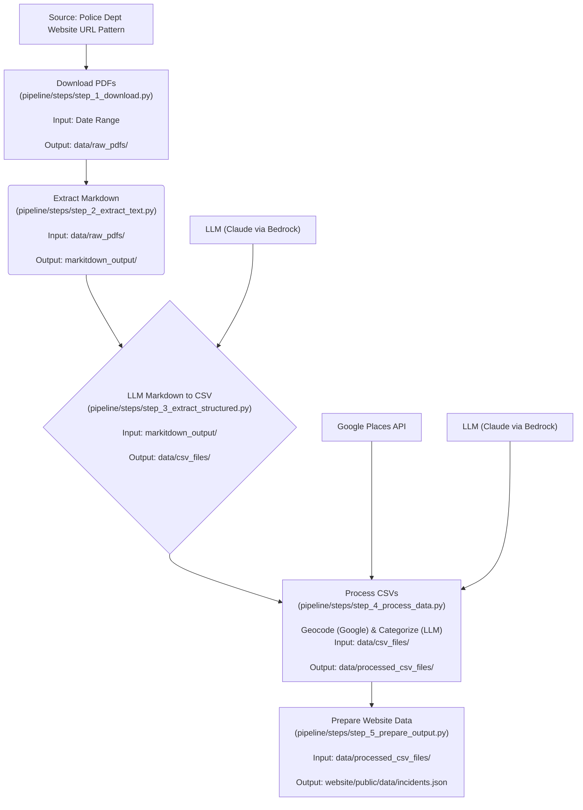

# Palo Alto Police Log Report Analysis

[](https://opensource.org/licenses/MIT)

## Overview & Data Sources
This project provides an end-to-end pipeline to download, process, and analyze daily police report logs (PDFs) from [Palo Alto Police Department's public information portal](https://www.paloalto.gov/departments/police/public-information-portal/police-report-log). The goal is to extract structured incident data (type, time, location), enhance it with geocoding and categorization, and prepare it for visualization and further analysis.

This repository is intended to be open-sourced to share the methodology and potentially enable adaptation for other similar public data sources.

 The pipeline relies on generating URLs based on dates, as the portal itself may only display recent links. No guarantees are made about the continued availability or format of this source data.

## Frontend Visualization (Website Submodule)

This project includes an interactive frontend visualization component, managed as a Git submodule in the `website/` directory pointing to the [palo_alto_police_log_visualizer repository](https://github.com/ma08/palo_alto_police_log_visualizer). This Next.js application provides a map-based interface to explore the processed police incident data. A live deployment of the visualizer is available at [https://palo-alto-police-log-visualizer.vercel.app/](https://palo-alto-police-log-visualizer.vercel.app/). *Note: The current data visualized on the live deployment covers the period from February 18, 2025, to April 18, 2025.*

The main input to the visualization is the [website/public/data/incidents.json](website/public/data/incidents.json) file, which is the output of the data pipeline.

## Project Goal & Data Pipeline

The primary goal is to create a reproducible and automated workflow for transforming publicly available, unstructured police report PDFs into structured, analyzable data. Key objectives include:

-   Automated downloading of daily PDF reports based on date ranges.
-   Robust extraction of text content from PDFs.
-   Leveraging Large Language Models (LLMs) for structured data extraction (CSV format).
-   Enhancing data with geographical coordinates via geocoding APIs.
-   Standardizing offense descriptions using LLM-based categorization.
-   Generating a clean, consolidated dataset suitable for frontend applications or data analysis tools.

The core process involves several automated steps, orchestrated by `run_pipeline.py`, which calls functions imported from the relevant pipeline step modules:



**Pipeline Stages:**

1.  **Download PDFs (`pipeline.steps.step_1_download.main`)**: Downloads daily police report PDFs from the Palo Alto website for a specified date range based on a URL pattern. Saves files to `data/raw_pdfs/`. Requires `--start-date` and `--end-date`.
2.  **PDF to Markdown (`pipeline.steps.step_2_extract_text.process_all_pdfs`)**: Converts the downloaded PDFs into markdown format using Microsoft's `markitdown` tool. Takes PDFs from `data/raw_pdfs/` and saves markdown files to `markitdown_output/`.
3.  **Markdown to CSV (`pipeline.steps.step_3_extract_structured.main`)**: Parses the markdown files, using an LLM (configured for Claude via AWS Bedrock) to extract structured data (case #, date, time, offense, location) into individual CSV files. Takes markdown from `markitdown_output/` and saves raw CSVs to `data/csv_files/`.
4.  **Process CSVs (`pipeline.steps.step_4_process_data.run_processing`)**: Reads raw CSVs from `data/csv_files/`.
    *   **Geocoding**: Uses the Google Places API (via `pipeline/utils/geocoding.py`) to convert location strings into coordinates and formatted addresses. Caches results in `data/geocoding_cache.json`.
    *   **Offense Categorization**: Uses an LLM (configured for Claude via AWS Bedrock) to map raw offense descriptions to predefined categories. Caches results in `data/offense_category_cache.json`.
    *   Saves the processed and augmented dataframes to `data/processed_csv_files/`.
5.  **Prepare Website Data (`pipeline.steps.step_5_prepare_output.prepare_data_for_website`)**: Reads processed CSVs from `data/processed_csv_files/`. Consolidates data, selects relevant columns, ensures correct data types (`time` as minutes-past-midnight number, `case_number` as string), filters records missing coordinates, and saves the final data ready for the web visualization as `website/public/data/incidents.json`.

## Data Storage

Intermediate and final data is stored in the following directories:

-   `data/raw_pdfs/`: Downloaded raw PDF reports.
-   `markitdown_output/`: Markdown files generated from PDFs.
-   `data/csv_files/`: Raw CSV files extracted from markdown using an LLM.
-   `data/processed_csv_files/`: Processed CSV files with added geocoding and offense categories.
-   `data/geocoding_cache.json`: Cache for Google Places API results to reduce costs.
-   `data/offense_category_cache.json`: Cache for LLM offense categorization results to reduce costs.
-   `website/public/data/incidents.json`: Final consolidated JSON data consumed by the frontend visualization.
-   `results/`: May contain analysis outputs like charts and markdown reports if analysis scripts (e.g., from `run_csv_pipeline.py` or others) are run.

## Setup

**NOTE:** Currently only Anthropic via AWS Bedrock is supported for LLM calls. Should be very easy to extend to other providers.

```bash
# Clone the repository (including the website submodule)
git clone --recurse-submodules [repository-url]
cd palo_alto_police_report_analysis

# Create and activate virtual environment
python -m venv venv
source venv/bin/activate  # On Windows: venv\\Scripts\\activate

# Install dependencies
pip install -r requirements.txt

# Configure API Keys and Credentials
cp .env.example .env
# Edit .env with your credentials:
# - Google Places API Key (for Step 4 Geocoding)
# - AWS Credentials (Access Key ID, Secret Access Key, Region for Step 3 & 4 LLM calls via Bedrock)
# 
```
## Usage

The primary way to execute the pipeline is using the `run_pipeline.py` script.

**Run the full pipeline:**

```bash
python run_pipeline.py --start-date YYYY-MM-DD --end-date YYYY-MM-DD
```

**Run starting from a specific step:**

Use the `--start-step` argument (1-5) to begin execution at a particular stage. This is useful for re-running later parts of the pipeline without repeating earlier steps.

```bash
# Example: Run only Step 4 (Process CSVs) and Step 5 (Prepare Website Data)
python run_pipeline.py --start-date YYYY-MM-DD --end-date YYYY-MM-DD --start-step 4
```

**Arguments:**

-   `--start-date`: Required. The first date for which to download reports (YYYY-MM-DD).
-   `--end-date`: Required. The last date for which to download reports (YYYY-MM-DD).
-   `--start-step`: Optional. The pipeline step number to start from (1-5, default: 1).

**Note:** Ensure all necessary API keys are configured in `.env` and dependencies installed before running. The script calls the internal functions of the pipeline stages sequentially.

## Project Structure

-   `run_pipeline.py`: Orchestrates the full data processing pipeline execution.
-   `pipeline/`: Core Python package for the data processing pipeline.
    -   `steps/`: Modules for each distinct pipeline stage.
        -   `step_1_download.py`: Step 1: Downloads PDFs.
        -   `step_2_extract_text.py`: Step 2: Converts PDFs to markdown.
        -   `step_3_extract_structured.py`: Step 3: Extracts structured data (CSV) from markdown via LLM.
        -   `step_4_process_data.py`: Step 4: Geocodes locations and categorizes offenses.
        -   `step_5_prepare_output.py`: Step 5: Consolidates data for the website JSON.
    -   `utils/`: Utility modules shared across pipeline steps.
        -   `geocoding.py`: Helper for Google Places API calls.
        -   `llm.py`: Helper(s) for LLM interactions (e.g., Bedrock).
-   `analysis/`: Scripts for analyzing the output data (separate from the processing pipeline).
    -   `analyze_csv_data.py`: Example analysis script.
    -   `analyze_markitdown_data.py`: Example analysis script.
-   `data/`: Data directories (see Data Storage section).
-   `markitdown_output/`: Intermediate markdown files.
-   `results/`: Analysis outputs (charts, reports) generated by scripts in `analysis/`.
-   `website/`: Frontend Next.js application (Git Submodule) for visualizing the data. See `website/README.md`.
-   `archive/`: Contains outdated scripts and previous analysis files.
-   `venv/`: Python virtual environment (if created).
-   `requirements.txt`: Core Python packages (now at root level).
-   `.env.example`, `.env`: Configuration for API keys and credentials.
-   `.gitignore`, `README.md`, etc.: Project configuration and documentation.

## Limitations

-   **Source Data Dependency:** Relies on the City of Palo Alto maintaining the current URL pattern and PDF format for reports. Changes will break the pipeline.
-   **Extraction Accuracy:** Data quality depends heavily on the `markitdown` conversion accuracy and the LLM's ability to correctly parse the markdown and extract structured data. Errors or inconsistencies in the PDFs can lead to extraction failures or inaccuracies.
-   **Geocoding Accuracy:** Relies on the Google Places API's ability to interpret location strings. Ambiguous or poorly formatted locations may result in incorrect or missing coordinates.
-   **Categorization Subjectivity:** LLM-based offense categorization depends on the prompt and model used. Results may vary or require fine-tuning.
-   **API Keys & Costs:** Requires active, correctly configured API keys for Google Places and an LLM provider (e.g., AWS Bedrock). Use of these services incurs costs, especially when processing large date ranges. Caching is implemented to mitigate this, but be mindful of potential charges.

## Contributing

Contributions are welcome! If you find issues or have suggestions for improvements, please open an issue or submit a pull request. Please ensure any contributions maintain the project's goal of a reproducible and automated workflow.

## License

This project is licensed under the MIT License - see the [LICENSE](LICENSE) file for details.