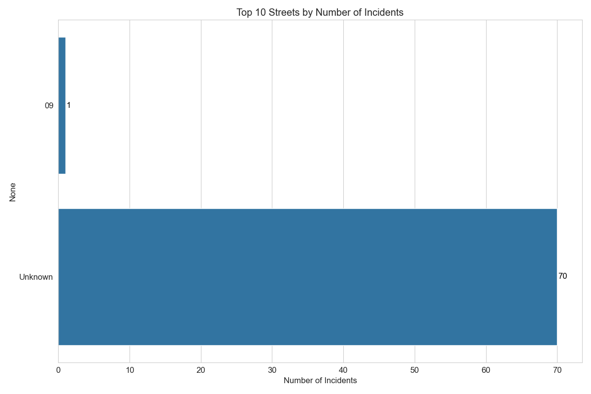
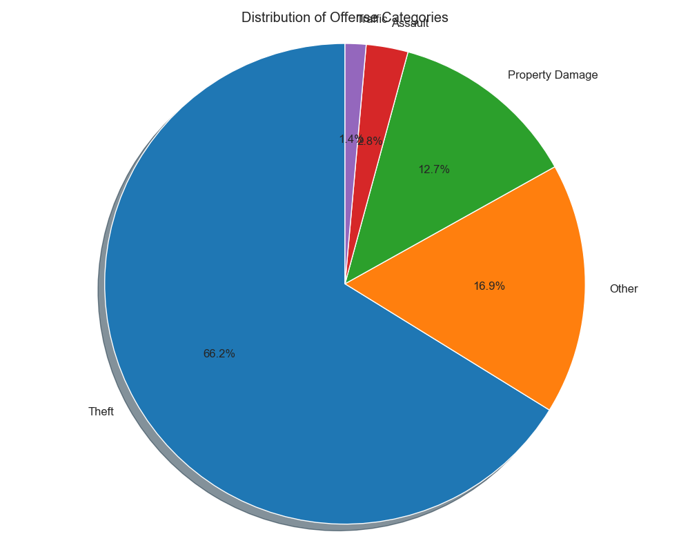

# Palo Alto Safety Analysis Report (Markitdown Extraction)

*Generated on: 2025-04-19*

## Overview

This report analyzes 71 police incidents extracted from Palo Alto Police Department logs from 2024-10-12 to 2025-04-13. The analysis is intended to help identify safer areas for housing in Palo Alto based on police incident reports.

## Incident Locations

The following streets have the highest number of reported incidents:

- **Unknown**: 70 incidents
- **09**: 1 incidents

## Incident Types

The incidents have been categorized as follows:

- **Theft**: 47 incidents (66.2%)
- **Other**: 12 incidents (16.9%)
- **Property Damage**: 9 incidents (12.7%)
- **Assault**: 2 incidents (2.8%)
- **Traffic**: 1 incidents (1.4%)

## Safety Analysis

### Areas with Lower Safety Concerns

These areas have fewer incidents and less severe types of incidents:

- **Unknown**: Safety Score: 5.73 (70.0 incidents)

### Areas with Higher Safety Concerns

These areas have more incidents or more severe types of incidents:

- **Unknown**: Safety Score: 5.73 (70.0 incidents)

## Recommendations for House Hunting

### Suggested Areas to Consider

Based on our analysis of police reports, these areas may be worth considering for their lower incident rates:

- **Unknown** area

### Areas That May Need More Research

These areas show higher incident rates and may warrant additional research before making housing decisions:

- **Unknown** area

## Conclusion

This analysis provides a data-driven overview of safety patterns in different Palo Alto neighborhoods based on recent police reports. While this information can be valuable for house hunting, it should be used as one of many factors in your decision-making process. We recommend complementing this analysis with personal visits to prospective neighborhoods at different times of day and speaking with local residents.

*Note: This analysis was generated using the markitdown tool for extracting text from PDF police reports.*
